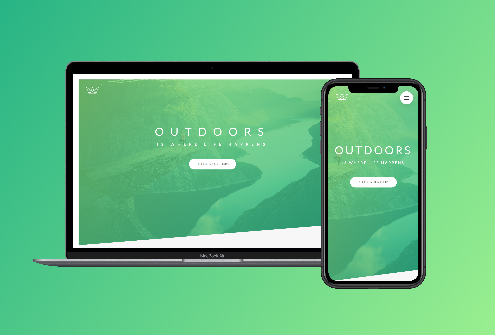

# Natours



Natours é uma Landing Page de uma agência de turismo, cujo objetivo é apresentar roteiros de viagem focados na natureza. Ela foi desenvolvida sem a utilização de flex-box ou grid.

### Ajustes e melhorias

O projeto ainda está em desenvolvimento e as próximas atualizações serão voltadas nas seguintes tarefas:

- [ ] Sidebar com links navegáveis
- [ ] Páginas de demonstração de cada tour

## 💻 Pré-requisitos

Fique atento aos requisitos do projeto:
* Você clonou o projeto ( HTTPS: https://github.com/luis291099/natours.git | SSH: git@github.com:luis291099/natours.git)
* Você instalou a versão mais recente de Nodejs (https://nodejs.org/en/);

## 🚀 Instalando Natours
Linux | macOS | Windows:
```
npm install
npm run build:css
```

## 🧑‍💻 Desenvolvimento
```
npm start (Live server e compilação dos arquivos SASS)
```